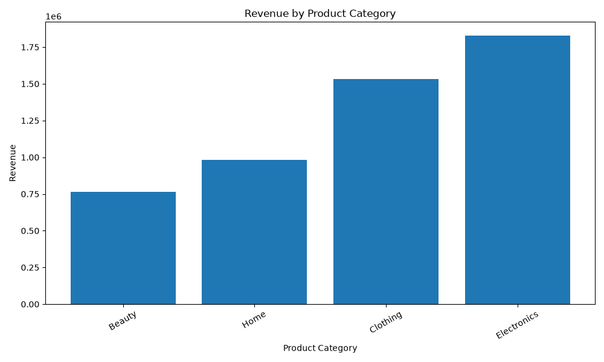
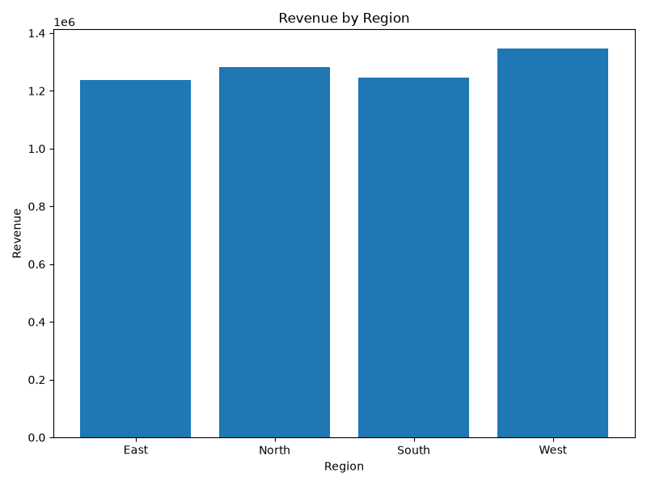
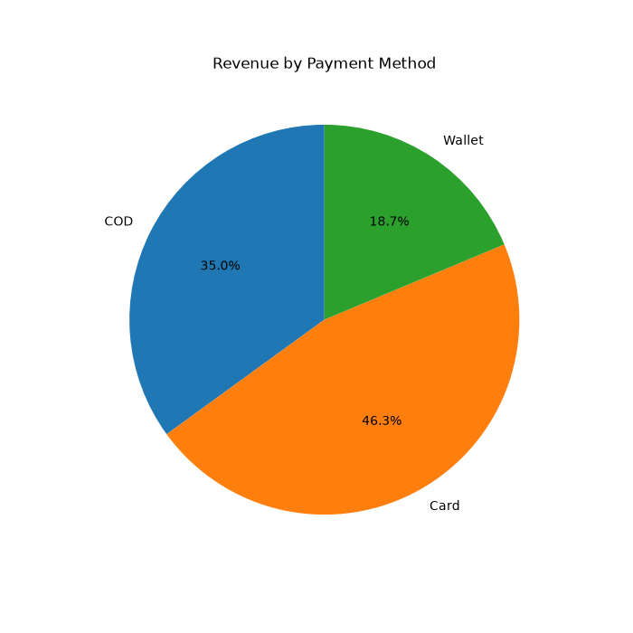
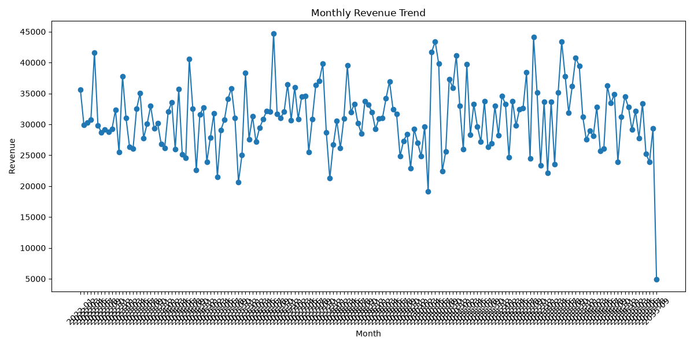
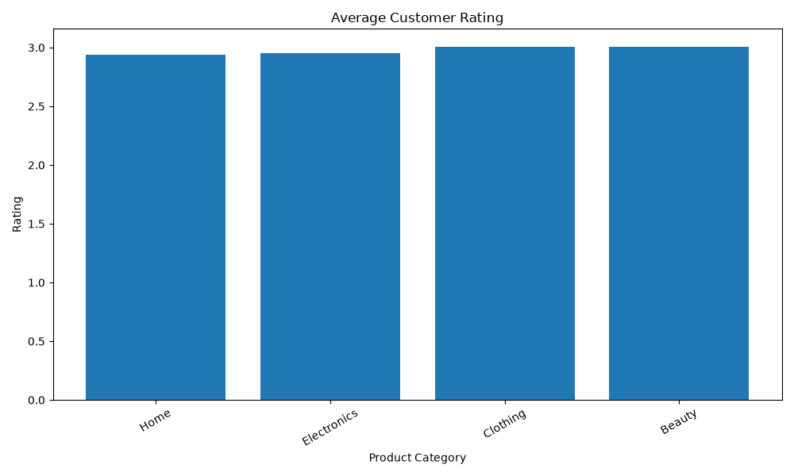
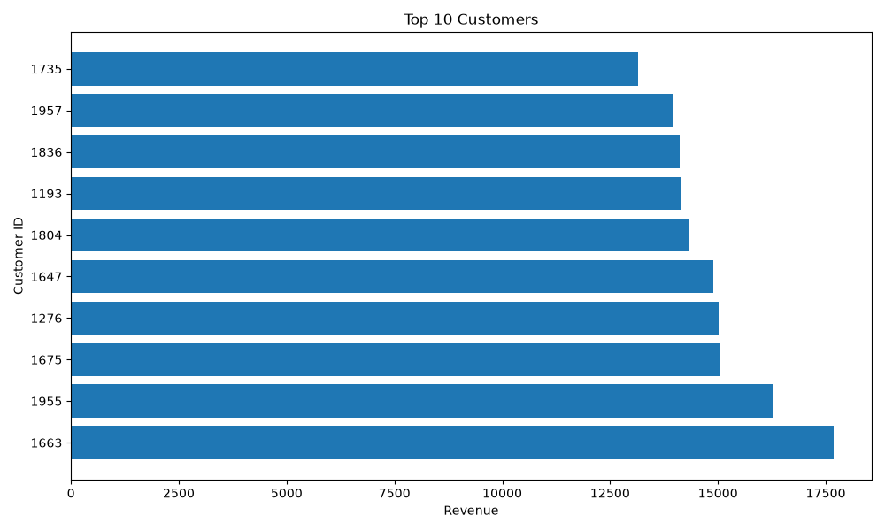

# 🛒 E-Commerce Sales Analytics using SQL & Python

<p align="center">


</p>

---

# 📌 Project Overview

This project analyzes an E-Commerce sales dataset using **SQL** and **Python** to uncover business insights related to sales, customers, products, regions, payment methods, and delivery performance.

The project demonstrates an end-to-end data analytics workflow, including:

- Data Cleaning
- SQL Analysis
- Exploratory Data Analysis (EDA)
- Business Insights
- Data Visualization
- Report Generation

This project is designed to showcase practical data analytics skills suitable for entry-level Data Analyst roles.

---

# 🎯 Project Objectives

- Analyze sales performance
- Identify top-performing products
- Discover customer purchasing patterns
- Analyze regional sales
- Evaluate payment methods
- Study delivery performance
- Visualize business insights

---

# 🛠 Tech Stack

| Tool | Purpose |
|-------|---------|
| Python | Data Analysis |
| MySQL | SQL Queries |
| Pandas | Data Cleaning |
| NumPy | Numerical Operations |
| Matplotlib | Data Visualization |
| VS Code | Development |
| Git & GitHub | Version Control |

---

# 📂 Project Structure

```text
Ecommerce-Sales-Analytics/

│
├── Data/
│   ├── ecommerce_sales_analytics_5000.csv
│   └── cleaned_sales_data.csv
│
├── SQL/
│   ├── database.sql
│   └── analysis_queries.sql
│
├── Python/
│   ├── 01_data_loading.py
│   ├── 02_data_cleaning.py
│   ├── 03_exploratory_analysis.py
│   ├── 04_visualizations.py
│   ├── 05_export_results.py
│   └── utils.py
│
├── Outputs/
│   ├── Charts/
│   ├── CSV/
│   └── Reports/
│
├── README.md
├── requirements.txt
└── .gitignore
```

---

# 📊 SQL Analysis

The project contains **58+ SQL queries** covering:

- KPI Analysis
- Product Analysis
- Customer Analysis
- Regional Analysis
- Payment Analysis
- Time-Series Analysis
- Delivery Performance
- Advanced SQL
  - CASE
  - CTE
  - Views
  - ROW_NUMBER()
  - RANK()
  - DENSE_RANK()

---

# 🐍 Python Analysis

Python was used for:

- Loading data
- Cleaning data
- Feature engineering
- Exploratory Data Analysis
- Business Insights
- Visualization
- Exporting reports

---

# 📈 Visualizations

## Revenue by Product Category



---

## Revenue by Region



---

## Payment Method Distribution



---

## Monthly Revenue Trend



---

## Customer Ratings



---

## Top Customers



---

# 📌 Key Business Insights

### 🛍 Product Analysis

- Identified the highest revenue-generating product categories.
- Compared product sales performance.
- Analyzed customer ratings by category.

---

### 🌍 Regional Analysis

- Compared revenue across different regions.
- Identified top-performing sales regions.
- Measured regional delivery efficiency.

---

### 💳 Payment Analysis

- Compared revenue by payment method.
- Identified the most preferred payment options.

---

### 🚚 Delivery Analysis

- Measured average delivery time.
- Compared delivery performance by region.
- Evaluated the relationship between delivery time and customer ratings.

---

### 📈 Time-Series Analysis

- Monthly revenue trends.
- Monthly order volume.
- Quarterly revenue comparison.

---

# 📁 Generated Reports

The project automatically generates:

- Data Quality Report
- KPI Report
- Product Analysis Report
- Customer Analysis Report
- Regional Analysis Report
- Payment Analysis Report
- Time-Series Report
- Delivery Performance Report
- Advanced SQL Report
- Python Reports

---

# 🚀 How to Run the Project

## 1️⃣ Clone Repository

```bash
git clone https://github.com/vermabhineet84-max/Ecommerce-Sales-Analytics.git
```

---

## 2️⃣ Navigate to Project

```bash
cd Ecommerce-Sales-Analytics
```

---

## 3️⃣ Create Virtual Environment

```bash
python -m venv venv
```

---

## 4️⃣ Activate Virtual Environment

### Windows

```bash
venv\Scripts\activate
```

### Linux / macOS

```bash
source venv/bin/activate
```

---

## 5️⃣ Install Dependencies

```bash
pip install -r requirements.txt
```

---

## 6️⃣ Run Python Scripts

```bash
python Python/01_data_loading.py
```

```bash
python Python/02_data_cleaning.py
```

```bash
python Python/03_exploratory_analysis.py
```

```bash
python Python/04_visualizations.py
```

```bash
python Python/05_export_results.py
```

---

# 💼 Skills Demonstrated

- SQL
- MySQL
- Python
- Pandas
- NumPy
- Matplotlib
- Data Cleaning
- Exploratory Data Analysis
- Data Visualization
- Business Analysis
- Feature Engineering
- Reporting
- Git
- GitHub

---

# 📚 Learning Outcomes

Through this project, I gained hands-on experience in:

- Writing analytical SQL queries
- Cleaning real-world datasets
- Performing exploratory data analysis
- Creating meaningful visualizations
- Building professional project documentation
- Organizing an end-to-end analytics workflow

---

# 👨‍💻 Author

**Abhineet Verma**

📧 Email: vermabhineet84@gmail.com

💼 LinkedIn: https://linkedin.com/in/abhineet-verma

🐙 GitHub: https://github.com/vermabhineet84-max

---

# ⭐ If you found this project useful, please consider giving it a Star!
